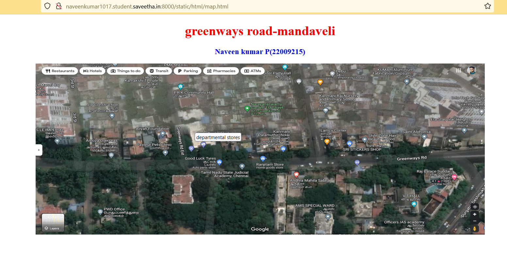
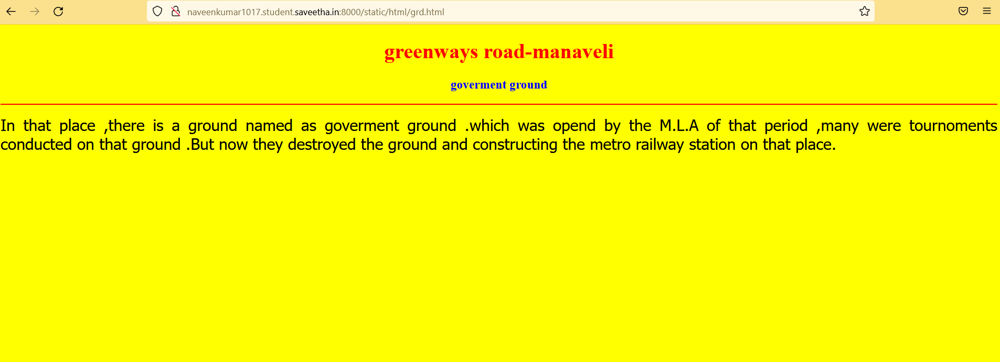
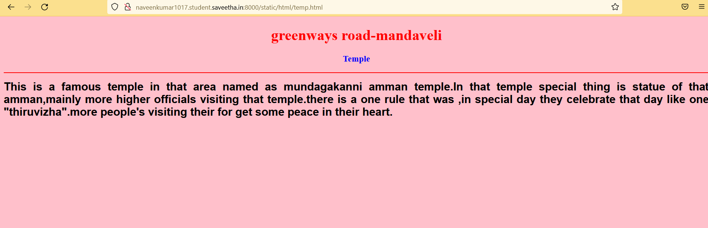
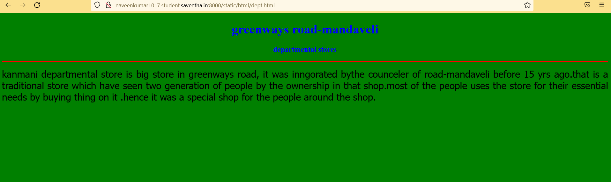
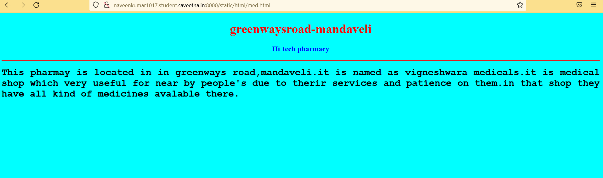
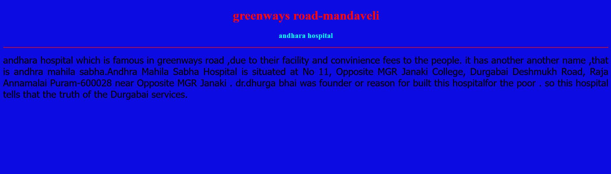
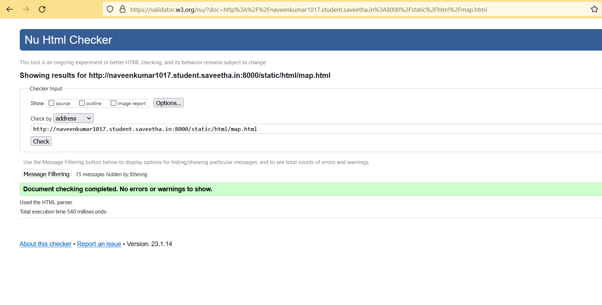

# Places Around Me
# Aim:
To develop a website to display details about the places around my house.

# Design Steps:
### Step 1
clone the github repository int theia IDE.
### Step 2
create a new django project.
### Step 3
write the needed HTML code.
### step 4
run the django server and execute the html files

## Code:
```
map.html
<!DOCTYPE html>
<html lang="en">
<head>
<title>My City</title>
</head>
<body>
<h1 align="center">
<font color="blue"><b>greenways road-mandaveli</b></font>
</h1>
<h3 align="center">
<font color="black"><b>Naveen kumar P(22009215)</b></font>
</h3>
<center>

<map name="MYCITY">
<area shape="circle" coords="190,50,20" href="/static/html/med.html" title="medical">
<area shape="rectangle" coords="230,30,260,60" href="/static/html/dept.html" title="departmental store">
<area shape="circle" coords="400,350,50" href="/static/html/hosp.html" title="andhra hospital">
<area shape="circle" coords="400,200,75" href="/static/html/temp.html" titlle="temple">
<area shape="rectangle" coords="490,150,870,320" href="/static/html/grd.html" title="goverment ground">
</map>
</center>
</body>
</html>

dept.html

<!DOCTYPE html>
<html lang="en">
<head>
<title>Departmental stores</title>
</head>
<body bgcolor="green">
<h1 align="center">
<font color="blue"><b>greenways road-mandaveli</b></font>
</h1>
<h3 align="center">
<font color="blue"><b>departmental stores</b></font>
</h3>
<hr size="3" color="red">
<p align="justify">
<font face="Tahoma" size="5">
kanmani departmental store is big store in greenways road, it was inngorated bythe counceler of road-mandaveli
before 15 yrs ago.that is a traditional store which have seen two generation of people by the ownership in 
that shop.most of the people uses the store for their essential needs by buying thing on it .hence it was a 
special shop for the people around the shop.
</font>
</p>
</body>
</html>

grd.html

<!DOCTYPE html>
<html lang="en">
<head>
<title>goverment ground</title>
</head>
<body bgcolor="yellow">
<h1 align="center">
<font color="red"><b>greenways road-manaveli</b></font>
</h1>
<h3 align="center">
<font color="blue"><b>goverment ground</b></font>
</h3>
<hr size="3" color="red">
<p align="justify">
<font face="Tahoma" size="5">
In that place ,there is a ground named as goverment ground .which was opend by the M.L.A of that period ,many
were tournoments conducted on that ground .But now they destroyed the ground and constructing the metro 
railway station on that place.
</font>
</p>
</body>
</html>

hosp.html

<!DOCTYPE html>
<html lang="en">
<head>
<title>andhra hospital</title>
</head>
<body bgcolor="yellow">
<h1 align="center">
<font color="red"><b>greenways road-mandaveli</b></font>
</h1>
<h3 align="center">
<font color="blue"><b>andhara hospital</b></font>
</h3>
<hr size="3" color="red">
<p align="justify">
<font face="Tahoma" size="5">
andhara hospital which is famous in greenways road ,due to their facility and convinience fees to the people.
it has another another name ,that is andhra mahila sabha.Andhra Mahila Sabha Hospital is situated at No 11, 
Opposite MGR Janaki College, Durgabai Deshmukh Road, Raja Annamalai Puram-600028 near Opposite MGR Janaki .
dr.dhurga bhai was founder or reason for built this hospitalfor the poor . so this hospital tells that the 
truth of the Durgabai services.
</font>
</p>
</body>
</html>

med.html

<!DOCTYPE html>
<html lang="en">
<head>
<title>medical</title>
</head>
<body bgcolor="cyan">
<h1 align="center">
<font color="red"><b>greenwaysroad-mandaveli</b></font>
</h1>
<h3 align="center">
<font color="blue"><b>Hi-tech pharmacy</b></font>
</h3>
<hr size="3" color="red">
<p align="justify">
<font face="Courier New" size="5">
<b>
    This pharmay is located in in greenways road,mandaveli.it is named as vigneshwara medicals.it 
    is medical shop which very useful for near by people's due to therir services and patience on 
    them.in that shop they have all kind of medicines avalable there.
</b>
</font>
</p>
</body>
</html>

temp.html

<!DOCTYPE html>
<html lang="en">
<head>
<title>Temple</title>
</head>
<body bgcolor="pink">
<h1 align="center">
<font color="red"><b>greenways road-mandaveli</b></font>
</h1>
<h3 align="center">
<font color="blue"><b>Temple</b></font>
</h3>
<hr size="3" color="red">
<p align="justify">
<font face="Arial" size="5">
<b>
This is a famous temple in that area named as mundagakanni amman temple.In that temple special thing is statue of that
amman,mainly more higher officials visiting that temple.there is a one rule that was ,in special day they celebrate 
that day like one "thiruvizha".more people's visiting their for get some peace in their heart.
</b>
</font>
</p>
</body>
</html>

```


## Output:












## HTML validator



## Result:
the program for implementing map image is executed.

